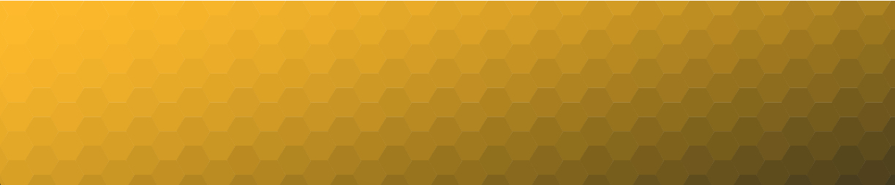

# svg-generator

Create an svg image.


## __installation__


Install globally to use anywhere to create an svg in the current directory.

```
npm i -g svg-generator
```


Local installation can be done as follows.
```
npm i -S svg-generator
```


## __usage__

Options:

- size: size of the repeating shapes default `3`
- start: staring colour `--start '#ffbb00` default `#fa6400`
- end: ending colour `--end '#88bbff` default `#3503fc`
- width: width of the svg viewbox `-width 200` default `100`
- height: height of the svg viewbox `--height 175` default `80`
- noise: add a random factor to the shape colors
- output: name of the file output `--ouptut 'generated-output.svg'` default is `output.svg`

Global usabe
```
svg-generator --start <hex-string> --end <hex-string> -w <width> --noise <noise> 
```

Local Usage
```
import svgGenerator from 'svg-generator';

svgGenerator({start: hexColor, end: '#ff0000}, <width default=8>, <number of cycles>);
```


## __example__

### CLI example

The following input will generate an svg.

```
$ svg-generator --start '#ffbb00' -w 400 --end '#222222' -n 0
```

An example screenshot of the svg 

